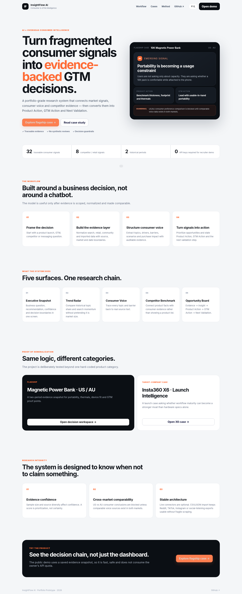
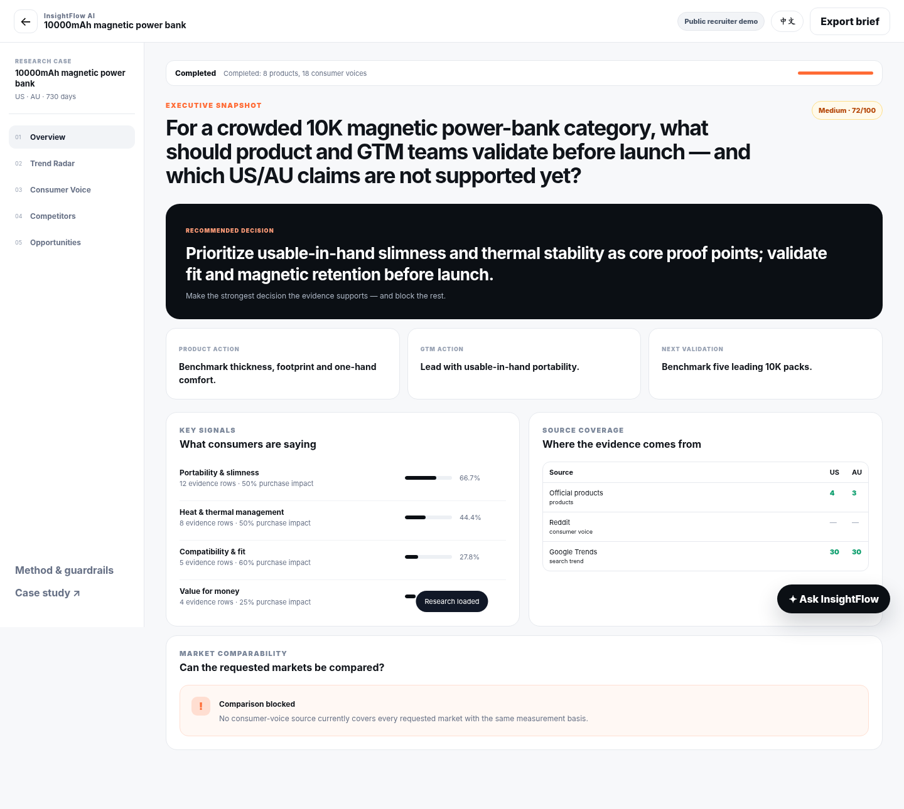

# InsightFlow AI

**Global Consumer & GTM Intelligence · Bilingual Recruiter Demo**

Online demo: **https://insightflow-ai.up.railway.app/**





InsightFlow turns fragmented overseas consumer signals into an auditable decision workflow:

**Evidence → Insight → Decision → Product Action / GTM Action / Next Validation**

The public website is designed for recruiters: it opens directly into a saved evidence-backed case, requires no API keys, does not spend the owner's SerpAPI / LLM quota, and clearly separates facts, inference and research boundaries.

## What this project demonstrates

- overseas consumer research and GTM reasoning
- evidence-first AI analysis rather than “LLM summary = truth”
- multi-source consumer voice and competitor benchmarking
- historical topic delta / Trend Radar
- cross-market comparability guardrails
- product action + GTM action + next validation
- bilingual Chinese / English portfolio UX
- safe public demo + deeper local analyst mode

## Core product surfaces

1. **Executive Snapshot** — business question, recommendation, confidence and decision boundary
2. **Trend Radar** — historical topic delta and within-market search momentum
3. **Consumer Voice** — traceable source evidence with topic / sentiment / driver / barrier labels
4. **Competitors** — product facts linked with consumer evidence
5. **Opportunity Board** — evidence → insight → product action → GTM action → next validation
6. **Ask InsightFlow** — evidence-grounded Q&A; public mode uses deterministic local answers so no private model quota is spent

## Data architecture

```text
LIVE CONNECTORS                         IMPORT LAYER
Google Shopping                        CSV / JSON
Walmart Reviews                        Reddit export
YouTube                                TikTok / Instagram export
Google Trends                          Brandwatch / Sprinklr export
                                       Survey / CRM / Support data
          \                               /
           -------- Evidence Layer -------
                       ↓
          AI / rule-based structuring
                       ↓
   Topic · Driver · Barrier · Scenario · Impact
                       ↓
 Trend · Consumer Voice · Competitor Benchmark
                       ↓
 Opportunity → Product Action → GTM Action
                       ↓
               Next Validation
```

The architecture intentionally does **not** require fragile Reddit / TikTok / Instagram scraping for the product to remain useful. Compliant exports can enter the same analysis pipeline through CSV / JSON.

## Portfolio cases

### Magnetic Power Bank · US / AU
A two-period evidence snapshot focused on portability, thermal stability, device fit and GTM proof points. The app deliberately blocks US-vs-AU consumer-preference claims because the saved consumer voice is not geographically comparable.

### Insta360 X6 · Launch Intelligence
A target-company application showing the same framework in a different category. The case asks whether creator workflow — record → reframe → export → share — can become a stronger moat as hardware specs converge.

## Research integrity rules

- no synthetic-review fallback
- review count is never presented as unit sales
- GLOBAL consumer evidence is not reassigned to a country
- Google Trends indices are not treated as cross-country market size
- opportunity scores prioritize validation; they do not estimate TAM / sales / PMF
- public recruiter mode hides connectors and blocks paid / secret-consuming actions

## Local analyst mode

Windows: double-click `START_WINDOWS.bat` or run:

```powershell
py -m venv .venv
.venv\Scripts\activate
pip install -r requirements.txt
python -m uvicorn app.main:app --host 127.0.0.1 --port 8000
```

Local mode can use:

- SerpAPI for structured live collection
- any OpenAI-compatible LLM / Sub2API endpoint
- CSV / JSON evidence import

## Railway deployment

The repository contains `railway.toml` and a checked deployment flow.

1. Run `DEPLOY_LIVE_WEBSITE.bat`
2. It creates a normal commit on top of current `main` (no force push)
3. Railway redeploys automatically
4. `VERIFY_LIVE_WEBSITE.ps1` checks the complete v1.6 website, bilingual Ask, demo evidence, market guardrail and public-mode secret protection
5. Put the URL on a resume only after it prints `PASS`

## Tests

```bash
python -m pytest -q
node --check static/app.js
```

Current final build: **v1.6.0**
